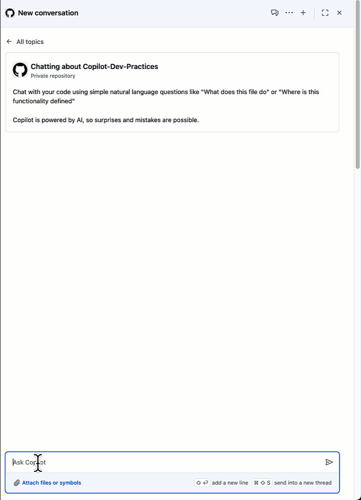
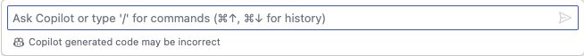
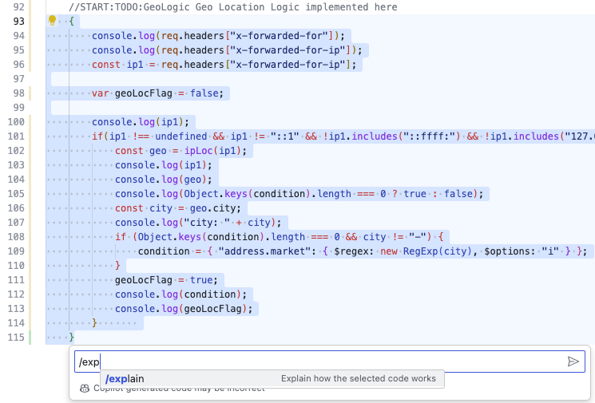

# Table of Sections

1. [Activity 1: New Developer on the Project](#activity-1-new-developer-on-the-project)
    1. [Start Copilot Chat in UI](#start-copilot-chat-in-ui)
    2. [Get Familiar with the Project](#get-familiar-with-the-project)
    3. [Explore Copilot for CLI in Codespaces](#explore-copilot-for-cli-in-codespaces)
    4. [Loading data file into MongoDB](#loading-data-file-into-mongodb)
    5. [Update frontend and backend port config](#update-frontend-and-backend-port-config)
    6. [Start backend and front end services](#start-backend-and-front-end-services)
    7. [Investigate backend URL 404 error](#investigate-backend-url-404-error)
    8. [Fixing backend URL in code](#fixing-backend-url-in-code)
    9. [Learn activity objectives and approach](#learn-activity-objectives-and-approach)
2. [Activity 2: New Feature/Requirement](#activity-2-new-featurerequirement)
    1. [Getting activity summary](#getting-activity-summary)
    2. [Identify library and generate test code](#identify-library-and-generate-test-code)
    3. [Improve test code to function](#improve-test-code-to-function)
    4. [Run the test code](#run-the-test-code)
    5. [Update code in IPLocation.js](#update-code-in-iplocationjs)
    6. [Adding doc in IPLocation.js](#adding-doc-in-iplocationjs)
    7. [Explain code in model.controller.js](#explain-code-in-modelcontrollerjs)
    8. [Update http-common.js to pass IP](#update-http-commonjs-to-pass-ip)
    9. [Refresh site](#refresh-site)
    10. [Run script to create PR](#run-script-to-create-pr)
    11. [Generate PR description summary](#generate-pr-description-summary)

# <h1 align="center">Activity 1: New Developer on the Project</h1>

## Start Copilot Chat in UI

`When you are on this project in browser, you'd have noticed a little Copilot icon next to your GitHub Avatar, on top right corner. 

Click to start a conversation with Copilot Chat


:warning: You must on this repository page under `githubuniverseworkshops` in order to see this icon

A new converseation pops up on the right hand side


Click  to add reference <br >


:warning: You may not see the option `Docs` as this is under internal preview. We will cover them in a demo towards th end of this workshop

Click  will let you manage threads. You can create and manage multiple threads if you like

Let's start using Copilot Chat in UI 🚙

## Get Familiar with the Project
Firstly as a new developer, I'd like to understand more about this project. 

It's great we have a few markdowns here. Add `PROJECT.md` as a reference
1. Add a reference -> File
2. In the prompt, scroll until you see `PROJECT.md`, select
3. This reference will be used in the chat moving forwards




Once done, asking Copilot Chat to explain the project.

```
Explain the project?
```

Keep asking additional questions, your reference stays unless you click to remove it.
```
Summarise the technical details?
```
```
What all is needed for running the project?
```

Based on output from Copilot for Chat, we learnt that this is a MERN stack, let's get hands-on. We will leverage next tool: Copilot for CLI

## Explore Copilot for CLI in Codespaces

Let's find how the setup of MERN going in Codespaces. In terminal, start typing
```
?? Check if node and npm is installed?
```
The starting `??` is one of 3 syntaxes of Copilot for CLI, we are asking for a shell command that can confirm installation of both Node and NPM.

We can see Copilot for CLI provided a suggestion, which we can choose to `Run`, `Revise` or `Cancel`. Go ahead with suggestion you will see the command output


Continue checking if MongoDB is running. This time, you were given a suggestion that looked working, but it is broken because `systemctl` is not supported in Codespaces and you were told to use `service` instead

```
?? Check if Mongodb service is running
```

Refine our question and try asking again 

```
?? Check if Mongodb service is running using service command
```

You should see MongoDB is running in our environment. And additional question

```
?? Check if mongoimport tool is available?
```

Copilot for CLI will give us another command to check if Mongo import tool is installed, possitive.

## Loading data file into MongoDB

MongoDB requires a JSON formatted dataset to serve as content in our site. As a new Developer, what if I don't know where the datafile is and how to load it?

Let's get back to Copilot Chat in UI 🏃

Resume our conversation, keeping the `PROJECT.md` reference there and try the following
```
What is the path of the MongoDB database json file?
```
```
Please tell me the Mongodb collection name?
```
Ok, we are able to identify file path of JSON as well as collection name. This time we will use Copilot for CLI to help us getting the right command

In Codespaces terminal, type:
```
?? mongodb import file=./mongodb-dataset/sample_airbnb.json, collection=listingsAndReviews
```

With that done, you may also noticed Copilot Chat do exist in Codespaces. Similar to Copilot Chat in UI, click to start a conversation. Because this time we want to do a bit of work in IDE. 

## Update frontend and backend port config
Asking Copilot Chat in Codespaces:
```
What is the local uri and port for mongodb?
```

## Start backend and front end services

As there are mutiple services involved, let's split terminal to manage them seperately. Please rename each terminal as `bash`, `backend` and `frontend` so to differentiate each other


Next we will start backend and frontend services one after another

👉 Select the `backend` terminal, then run:
```
cd backend && npm start
```
👉 Select the `frontend` terminal, then run:
```
cd frontend && npm start
```

Upon completion of frontend starting, you will be prompt by Codespaces to open web URL in a new window, click to proceed on the one with port `3000`. Alternatively, find `PORTS` and click the little globe icon for port `3000`


You will see `Backend URL: NOT FOUND: 404` error. Don't worry, we will fix it together next 👀


## Investigate backend URL 404 error

Now we got a 404 error, let's take a look at the message and copy the 404 URL in the message. 

`https://shiny-acorn-v64jvpv96xwhp9g4-8080.app.github.dev`

As part of Codespace initiation, every instance starts with a random name. This `shiny-acorn` does not match the one in our browser. 

Any chance this could be hardcoded in our project? Possibly. Let's find it out. Head to your terminal `bash` (not `backend` or `frontend` as they have processes running in foreground) and run the following:

```
?? find string "shiny-acorn-v64jvpv96xwhp9g4-8080.app.github.dev" inside current folder except node_modules
```

This might take up to 30 seconds. You should be see result `/.frontend/src/http-common.js`. Now open that file in Codespaces.


This time let's try Copilot Chat in IDE. Similar to Copilot Chat in UI, we can add context alongside our questions. In IDE, we need to select exact line of code instead of an open file, then ask questions:


This `baseURL` catches our attention here. Checking the code we found it is hardcoded also. 

Double checking using Copilot Chat in UI. Adding file `WORKSHOP.md`, then ask

```
Which frontend file has the backend uri endpoint?
```

Copilot Chat tells you that `./frontend/src/http-common.js` contains the backend uri endpoint definition. So we can safely update `baseURL`. 

## Fixing backend URL in code

Back to Codespaces and execute the following:
- [ ] Head to `PORTS` next to `TERMINAL`
- [ ] Copy the Forwarded Address indicating Port `8080`
- [ ] Replace `baseURL` with this new URL
- [ ] Don't forget to check the tailing `/api` is there


We also need to change visibility of port `8080` to `public` in order to allow frontend to query:
- [ ] Stay on `PORTS` section, right click port `8080`
- [ ] Port Visibility -> Public


Switch to the web url tab, refresh the page, You should start seeing content loading up 🥳


## Learn activity objectives and approach

With the project up and running 🎉. We are ready to make some changes to the project. How long did you take to get familiar with a new project last time?

Continue Copilot Chat in UI, with `WORKSHOP.md` selected, ask a few questions about Activity 1:

```
In Section Workshop's Different Developer Activities, summarise Activity 1 in bullet points?
```
```
In Section Workshop's Different Developer Activities, Activity 1, summarise the fix / requirement for Activity 1 in bullet points?
```

Continue with the following two questions. Keep 

```
What are different Frontend React Paths available?
```
```
What are different backend endpoints exposed and unexposed?
```

# <h1 align="center">Activity 2: New Feature/Requirement</h1>

## Getting activity summary

In Copilot Chat Browser, select `WORKSHOP.md` then ask 
```
Can you list all the bullet points from Activity 2?
```
You will find that `IP2Location` is to be used, also `Local Geo Location Database` is available for this workshop. We already have put placeholder for you, under the `/backend/geolocation` to build the code and local geolocation database being available.

Let's build with Copilot in Codespaces

## Identify library and generate test code

In Codespaces, use Copilot Chat(IDE) to start exploring code. We'd like to get some solid ground first:
```
Share example nodejs geo location packages?
```
Chances are that Copilot Chat does not tell anything about IP2Location, let's try another one specific:
```
Does npm have packages using IP2LOCATION?
```
This time, Copilot Chat tells us that `ip2location-nodejs` is available, and it is able to query IP geolocation information from a local BIN database. Let's see if we can get more details from Copilot Chat:
```
From ip2location NodeJs - Query geolocation information from Local BIN database
```
Copilot Chat would return sample code along with explanation. Let's take the sample code and update `./backend/geolocation/test.js` to begin with
```Javascript
const IP2Location = require("ip2location-nodejs");

// Load the BIN database file
const ip2location = new IP2Location("path/to/database.bin");

// Query the geolocation information for an IP address
const ip = "8.8.8.8";
const result = ip2location.lookup(ip);

// Print the results
console.log(result);
```

## Improve test code to function

We'd like to get more how-tos in the next step, and it's time find some documentation about `IP2Location`. Ask Copilot Chat:
```
Share the link to npm ip2location-nodejs documentation
```
You should get the link https://www.npmjs.com/package/ip2location-nodejs, now click and open in a new tab.

In the section `Developer Documentation`, click on https://ip2location-nodejs.readthedocs.io/en/latest/index.html

Here we found a very good example to [Query gelocation information from BIN database](https://ip2location-nodejs.readthedocs.io/en/latest/quickstart.html#query-geolocation-information-from-bin-database), copy this code an update `./geolocation/test.js`

You may notice that `ip2location.open` is hitting a file path, we need to replace `./DB26.BIN` with an actual file in our project, which is `.backend/geolocation/IP2LOCATION-LITE-DB3.BIN` inside the repo. Update accordingly. 

You final code should look like below:
```javascript
const {IP2Location} = require("ip2location-nodejs");

let ip2location = new IP2Location();

ip2location.open("./geolocation/IP2LOCATION-LITE-DB3.BIN");

testip = ['8.8.8.8', '2404:6800:4001:c01::67'];

for (var x = 0; x < testip.length; x++) {
	result = ip2location.getAll(testip[x]);
	for (var key in result) {
		console.log(key + ": " + result[key]);
	}
	console.log("--------------------------------------------------------------");
}

ip2location.close();
```

## Run the test code

We can run a quick test on this `test.js`, further by saving the result to a file to inspect. Try the following with Copilot CLI:
```
?? run ./backend/geolocation/test.js and save result into ./backend/geolocation/test_result.json
```

Proceed with the recommendation or run `node ./backend/geolocation/test.js > ./backend/geolocation/test_result.json` if you got issues. You will see `./backend/geolocation/test_result.json` appears. Openning that up you might see there are JSON within it but ip is unknown and a bunch of `MISSING_FILE`

That says we can get the response with the expected format. This `test.js` will be a useful reference to Copilot updating actual code inside our project. Let's take a look at that next step.

## Update code in IPLocation.js

While leaving the file `.backend/geolocation/test.js` open(which will help Copilot to use as project reference), find `.backend/geolocation/IP2Location.js` and open in Codespaces

The file should have code look like below
```javascript
// Import the IP2Location module
const { IP2Location } = require("ip2location-nodejs");

// Create a new IP2Location object
const ip2location = new IP2Location();
ip2location.open("./geolocation/IP2LOCATION-LITE-DB3.BIN");

// Export a function for IP geolocation
module.exports.ipLoc = function (IP) {
    // Define function-specific variables
    const _func = "ipLoc";
    const debug = true;
    let result, returnObj;

    // Log debug information
    if (debug) {
        console.log(`${_func}: entry`);
    }

    try {        
        {
            //START:TODO - GeoLocation Logic to Implement

            
            //END:TODO
        }        

    } catch (err) {
        // Log any errors that occur
        console.log(`${_func}: error -> ${err}`);
    }
};
```

You will see a code block `START:TODO` and `END:TODO`, let's start coding with Copilot prompts. Remove these comment, then start typing below
```
//Find the geolocation using the IP input from the local file, and return ip, country and city
```

Press `ENTER`, Use Copilot will start generating code, press `TAB` to accept, then `ENTER` to next line. You should end up this part like below
```javascript
    try {        
        {
            //Find the geolocation using the IP input from the local file, and return ip, country and city
            result = ip2location.getAll(IP);
            returnObj = {
                ip: result.ip,
                country: result.country_short,
                city: result.city
            };
        }        

    } catch (err) {
        // Log any errors that occur
        console.log(`${_func}: error -> ${err}`);
    }
```

## Adding doc in IPLocation.js

Brilliant! We got some code, but before we move to next, let's make `IPLocation.js` better by adding some docs.

It's a boring task right? Let's see what Copilot can do for you

Stay on `IPLocation.js`, click line 1. Then type the following key combinations:
- On `Mac`: Key in `Cmd+I`
- On `Windows`: TODO

This is the shortcut to command Copilot 💻! Now type `/doc` and `ENTER`



Wooa! Copilot generates some docs for you based on the new code we just added. It also asks for your review. Click `Accept` button. 


You final version of `IPLocation.js`

```javascript
// Import the IP2Location module
const { IP2Location } = require("ip2location-nodejs");

/**
 * Creates a new IP2Location object and exports a function for IP geolocation.
 * @module IP2Location
 */

// Create a new IP2Location object
const ip2location = new IP2Location();
ip2location.open("./geolocation/IP2LOCATION-LITE-DB3.BIN");

/**
 * Returns the geolocation information for a given IP address.
 * @function
 * @param {string} IP - The IP address to geolocate.
 * @returns {Object} An object containing the IP address, country, and city.
 */
module.exports.ipLoc = function (IP) {
    // Define function-specific variables
    const _func = "ipLoc";
    const debug = true;
    let result, returnObj;

    // Log debug information
    if (debug) {
        console.log(`${_func}: entry`);
    }

    try {        
        {
            //Find the geolocation using the IP input from the local file, and return ip, country and city
            result = ip2location.getAll(IP);
            returnObj = {
                ip: result.ip,
                country: result.country_short,
                city: result.city
            };
        }        

    } catch (err) {
        // Log any errors that occur
        console.log(`${_func}: error -> ${err}`);
    }
};
```
## Explain code in model.controller.js

We learnt previously that you can command Copilot to geenrate doc. Let's try another command this time. 

Open `/backend/app/controllers/model.controller.js`, search in the file START:TODO

Select the code block below it, then key in `Cmd+I`, type `/explain` then enter.



The command `/explain` is passed to Copilot Chat for an answer. Very handy isn't it?


## Update http-common.js to pass IP

Now we are getting close to completing all changes 🦾. One thing left is to update `/frontend/src/http-common.js` 

You will see a list of commented `x-forwarded-for-ip`, uncomment one of them so we can pass IP in the request header.

## Refresh Site

Refreshing the site. Depending on which `x-forwarded-for-ip`, the listing is now shortlisted

## Run script to create PR

With that, we are comfortable to push our changes back. There is a script prepared for you. Run `code ./scripts/git_branch_push.sh` to open the script file to have a look

What it does:
1. creating a feature branch `geo-location-logic`
2. carrying all the changes we introduced(new files such as `test.js` won't be added, only changes to existing project files)
3. push to remote branch of the same name

Run the script by running `./scripts/git_branch_push.sh`

## Generate PR description summary

Get back to your project repo on GitHub UI, you should be able to see a prompt asking you creating a Pull Request for branch `geo-location-logic`


Click to proceed, we want to write something about this PR. In real projects, this is almost essential to reviewers. Can GitHub Copilot help? That answer is possitive ✨

You will notice description editor now also empowered with Copilot Icon. This is where you can access Copilot for PR on writing description. Click the icon then the summary


Copilot will take sometime to extract code changes, together with project contexts, and generate description ready for you!

Once ready, create the PR and merge it and we are done in Activity 2 🎉
